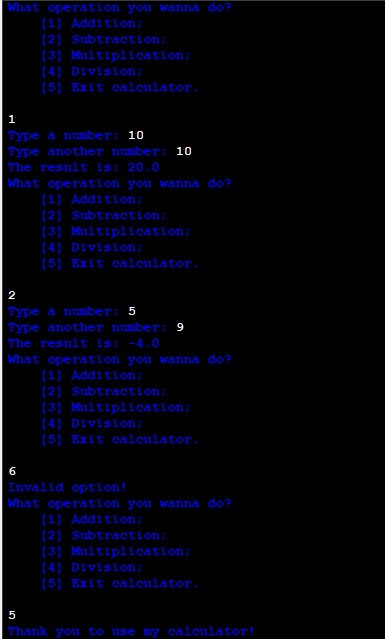

# Basic Calculator in Python
I think that a large part of the programmers that begin in this area made, as a first project, a calculator. This is my calculator using the language Python. In this project, I made a simple calculator that can perform:

Addition;
Subtraction;
Multiplication;
Division.

The project has some limitations, like being able to perform the calculation only between two numbers, and needing to pay attention to the numbers order.

For this project, I used variables to store the numbers and used a looping ```while True``` to keeping the program working until the user wants. Furthermore, I used ```if``` conditions to calculate every result.

It's one of the first steps that I took to achieve my goal: to be a programmer!

I hope you enjoy it!

***
## The terminal



***
## How to run

1) With your VS Code, make sure you have Python installed on your machine;
2) Clone this repository: git clone https://github.com/icaroscardua/basic-calculator-python.git;
3) Navigate to the project folder: cd basic-calculator-python;
4) Run the program: basic-calculator-python.py

***
## Example of use

```python
What operation you wanna do?
  [1] Addition;
  [2] Subtraction;
  [3] Multiplication;
  [4] Division;
  [5] Exit calculator.

1
Type a number: 10
Type another number: 4
The result is: 14.0
What operation you wanna do?
  [1] Addition;
  [2] Subtraction;
  [3] Multiplication;
  [4] Division;
  [5] Exit calculator.

5
Thank you to use my calculator!
```
